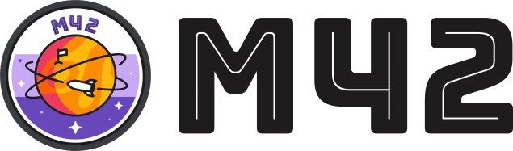

# M42 app



M42 is a progressive web application with tiny tools for learning.

## Quick links

- [Contributing](./CONTRIBUTING.md)
- [Changelog](./CHANGELOG.md)

## Key features

- Fast non-blocking computations with web workers
- No tracking, no ads, no other server connections – everything runs in browser only
- Full offline support
- Dark theme support
- All-in-one application for everyday tasks

## Included Applications

- CVC Words

## Local development

To get started with application locally use these commands:

```sh
# Install dependencies
yarn

# Start application, browser will open automatically
npm start
```
